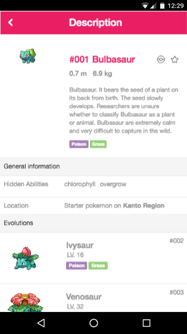

# CodeChallenge1-DavidSosaValdes

This is the first challenge of Accenture-Bootcamp: Pokedex v0.0.1

## Demo

## Requirements

- [X] Mobile first
- [X] Use Less for CSS
- [X] Use Bootstrap UI
- [X] Follow the guidelines

## Additional features:

- [ ] apple-mobile-web-app-capable
- [ ] android-mobile-web-app-capable
- [X] AngularJS (Base with dummy data)

## Installation

First off, let's install all the dependencies:

	npm install
	bower install

Next move all the assets to their directories with the `npm` command:

	bower-installer

Finally compile the main stylesheet using LESS with the command:

	lessc src/less/styles.less > public/css/styles.css
